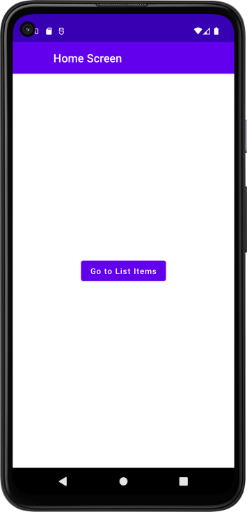
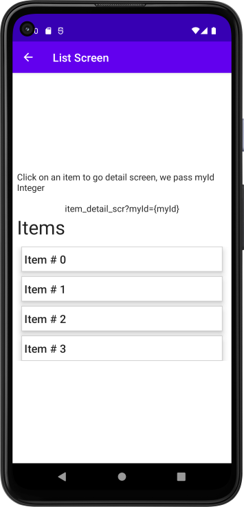
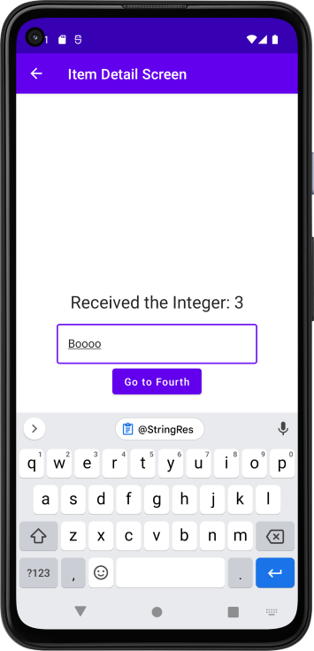
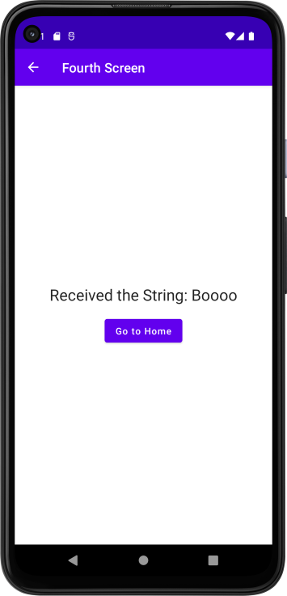

 # Demo Simple Navigation with TopAppBar
Simple app to demonstrate Compose screen navigation with TopAppBar

**Demo App with 4 screen.**

**Navigates from**
- Home Screen to a List Screen. Nothing passed. simple route
- List Screen to Detail screen. We pass an Integer in the route
- Detail Screen to Forth Screen. We pass a the inputted string in the route
- Forth Screen back to Home Screen. We popStack with false

### TopAppBar Notes
- We are using a single scaffold across the app  
- We check previousBackStackEntry to determine if we can navigate back, and display back arrow in topappbar
- We are not using Material Design 3 yet.

### Navigation Notes
- We are not using the enum class.  
- We are not using XxxxScreenDestination object defined on top of screen class  
  - logic for this in each screen file is commented out
- We are using a sealed class for ScreenDestinations called Screens.

  
    
    
    
    

ref: demo-simple-navigation-with-topappbar-app-android-kotlin-compose